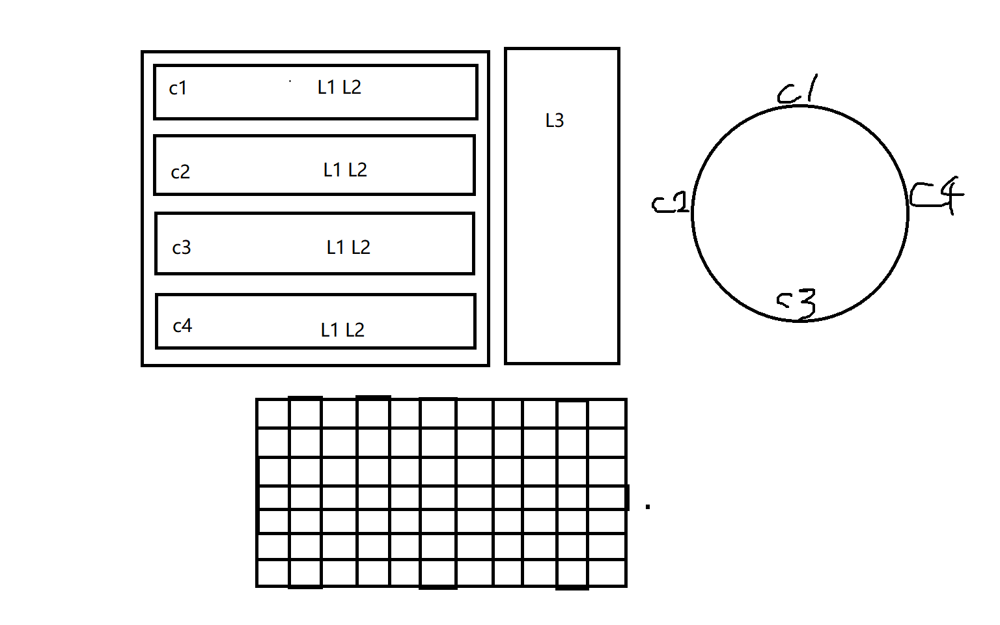

# Concurrency
> We're always gonna be responsible for synchronization and orchestration
 
## process
there's two big key resources, **memory** and **thread**

thread path of execution, manage the path of linear execution

```
running(in a core)
```
### 线程
操作系统线程的调度是抢占式的，因而无法预测线程执行的顺序，特别是线程任务趋近相同时。

线程将会在核心上执行至操作系统认为应当切换线程为止，切换时进行情景切换，情景切换时为让被切换的线程
可快速恢复执行状态，将会保存状态信息

线程有三种状态：running runnable waiting

running 的线程正在占有核心
runnable 的线程可被切换
waiting 正在做 i/o 或 数据库操作等

线程有一个大小为 1m 的栈



当有多个核心时，核心间需要沟通，因而需要保证之间的通路较短。
核心较少时，可构成环状，较多时，可构成矩阵。

caching systems are a way of reducing those cache line and TLB misses
here within our processors
### 线程池
windows iocp


