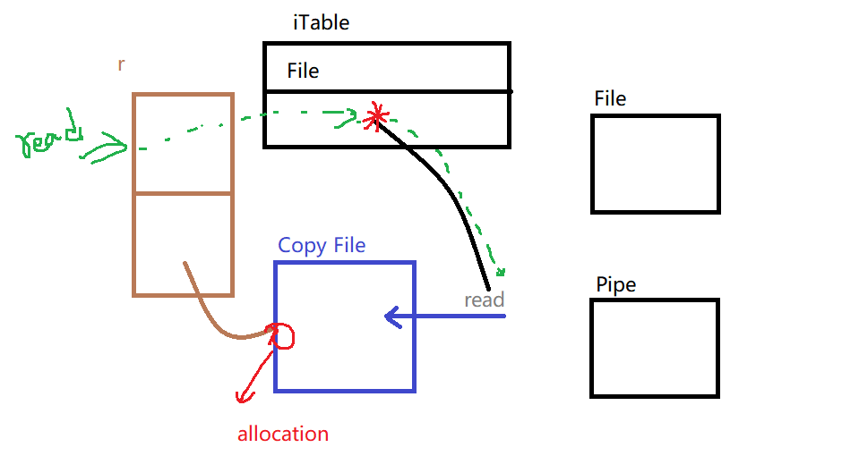

# Interface
## Polymorphism
> "Polymorphism means that you write a certain program and it behaves differently depending on 
> the data that it operates on." - Tom Kurtz(inventor of BASIC)


Interfaces are not real. They only define a method set of behavior. They define
a contract of **behavior**.

```go
// interface r are not real
var r reader
```

tell me which interface better.
```go
type reader interface {
	read(b []byte) (int, error)
	
	read(n int) ([]byte, error)
}
```

> Go is about convention over configuration.

We just have to declare the method, and the compiler compile time can identify
interface compliance, satisfaction.




## Method Sets and Address of Value
if we're working with our value semantics here, working with `T`, using values semantics, 
belong to the method set.
```
T  |                 | Value Reciver
*T | Pointer Reciver | Value Reciver
```

Not every value has address.

it's never safe to make a copy of value. If you use pointer semantics, you only allow to share,
and don't allow to make a copy of the value that the pointer points to.
